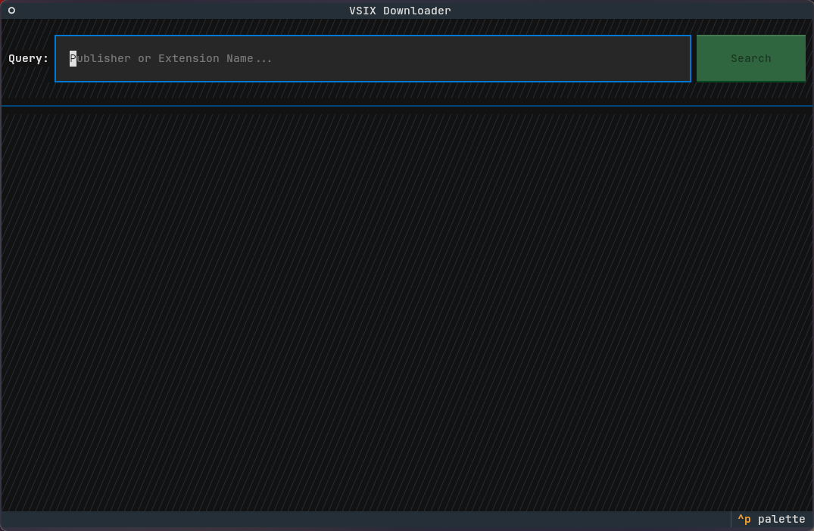
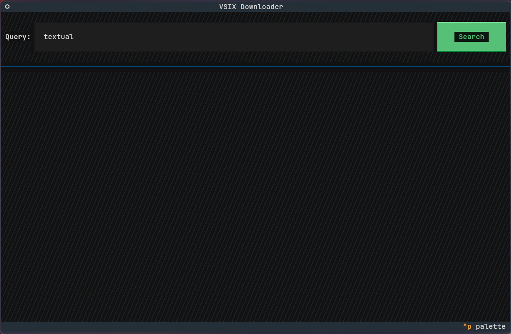
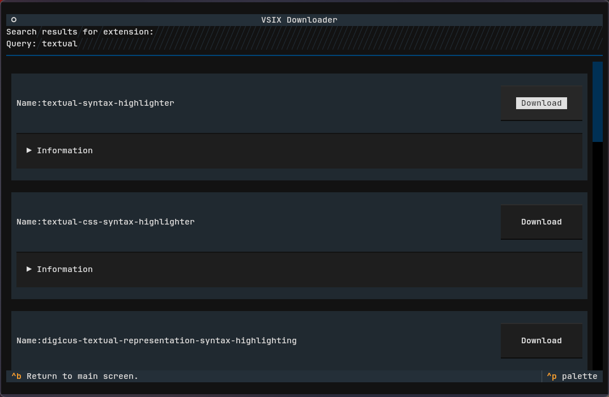
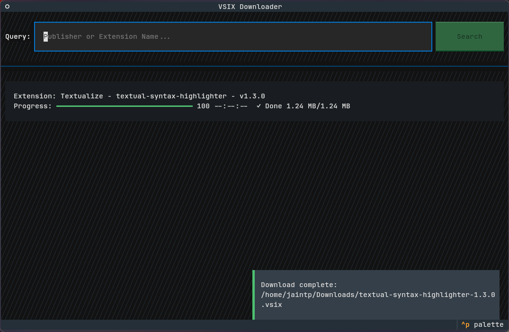

# VSIX Downloader

A terminal-based application for searching, downloading, and managing Visual Studio Code extensions (VSIX files). Built using the [Textual framework](https://textual.textualize.io/), this application provides a TUI (Text-based User Interface) for seamless navigation and efficient extension management.

Primarily for Linux users who cannot find or install VS Code extensions directly through their editor and are unable to access download links on the marketplace website.

**Disclaimer**: This project utilizes a **non-public Visual Studio Marketplace API** that is not intended for use outside of Microsoft products. Use this application at your own discretion.

---

## Screenshots
After opening the application.  
  
Before searching.  
  
Search Screen.  
  
Main Screen after downloading.  


## Demo Video

[Watch the demo on Youtube, because GIFs suck...](https://www.youtube.com/watch?v=PCRzxT24KoU)
---

## Features

- **Search Functionality**: Query the Visual Studio Marketplace for extensions by name or publisher.
- **Download Management**: Monitor download progress with a dynamic progress widget.
- **Extension Details**: View metadata for each extension, including publisher, version, and description.
- **Interactive UI**: Navigate screens and manage downloads with ease using a terminal-based interface.

---

## Installing UV

### Install `uv`

install `uv` via following the instructions on their [website](https://docs.astral.sh/uv/getting-started/installation/).

#### Linux
```bash
curl -LsSf https://astral.sh/uv/install.sh | sh
# Or
wget -qO- https://astral.sh/uv/install.sh | sh
```

#### Windows (Limited Usefulness)
##### Using PowerShell
```powershell
powershell -ExecutionPolicy ByPass -c "irm https://astral.sh/uv/install.ps1 | iex"
```

#### Python Install Tools
##### Using PyPI
```bash
pipx install uv
```
##### Or with Pip
```bash
pip install uv
```

## Installation

### Clone the Repository

```bash
git clone https://github.com/JaINTP/vdl.git
cd vdl
```

### Build the Project

Build the project using `uv`:
```bash
uv build
```

### Install Dependencies

Install as a `uv` tool:
```bash
# Install the latest build
uv tool install dist/vdl-0.1.0-py3-none-any.whl
```

### Run the Application

Launch the application:
```bash
uv tool run vdl
# Or
uvx vdl
# Or, if UV installed it to ~/.local/bin
vdl
```

---

## Usage

1. **Search for Extensions**:
   - Use the search bar on the main screen to enter a publisher name or extension name.
   - Click the "Search" button to query the marketplace.

2. **View Extension Details**:
   - Select an extension from the search results to view detailed metadata.

3. **Download Extensions**:
   - Click the "Download" button for a selected extension to initiate the download process.
   - Monitor progress in the progress list.

---

## Project Structure

```
VSIX Downloader/
├── src/
│   ├── vdl/
│   │   ├── downloader/
│   │   │   ├── __init__.py
│   │   │   ├── download_manager.py              # Manages the download process
│   │   │   ├── vsix_api_handler.py              # Handles API requests to the marketplace
│   │   ├── models/
│   │   │   ├── __init__.py
│   │   │   ├── extension.py                     # Data model for extensions
│   │   ├── tui/
│   │   │   ├── __init__.py
│   │   │   ├── app.py                           # Main Textual application module
│   │   │   ├── screens/
│   │   │   │   ├── main_screen.py               # Main interface for search and downloads
│   │   │   │   ├── search_screen.py             # Displays search results
│   │   │   ├── widgets/
│   │   │   │   ├── __init__.py
│   │   │   │   ├── download_progress_widget.py  # Tracks download progress
│   │   │   │   ├── extension_widget.py          # Displays extension details
│   │   │   │   ├── search_widget.py             # Search input and button widget
│   ├── styles.tcss                              # Terminal styles for the application
├── __main__.py                                  # Entry point for the application
```

---

## Notes

- **API Disclaimer**: This application uses a **non-public Visual Studio Marketplace API** that is not officially documented or intended for external use.
- **Experimental Status**: This project is a proof-of-concept and may not be suitable for production environments.
- **Bug Reports**: Contributions for bug fixes and enhancements are greatly appreciated.

---

## Requirements

- Python 3.12+
- Dependencies managed through `uv`

*Note: Compatibility issues have been observed with Python 3.13 due to pydantic/pydantic-core.*

---

## Contributing

Contributions are welcome! Follow these steps to get started:

1. Fork the repository.
2. Create a new branch for your feature or bug fix:
   ```bash
   git checkout -b my-feature
   ```
3. Commit your changes:
   ```bash
   git commit -m "Add my feature"
   ```
4. Push your changes to your branch:
   ```bash
   git push origin my-feature
   ```
5. Open a pull request on GitHub.

---

## TODO List

- [x] Ensure the project is functional.
- [ ] Handle cases with zero returned search results  
(e.g., replace the VerticalScroll container with a static element).
- [ ] Implement caching for API requests with an expiry mechanism.
- [ ] Improve the CSS for better visual design.
- [ ] Add a user-customizable configuration file.
- [ ] Develop a settings screen for user customization.
- [ ] Introduce multiple themes for enhanced user experience.

---

## License

This project is distributed under the [MIT License](LICENSE).

---

## Acknowledgments

- [Textual Framework](https://textual.textualize.io/): For providing the foundation for this terminal-based UI application.
- My partner, GIzmo: For pretending she gave a shit about the project while I talked about it.

